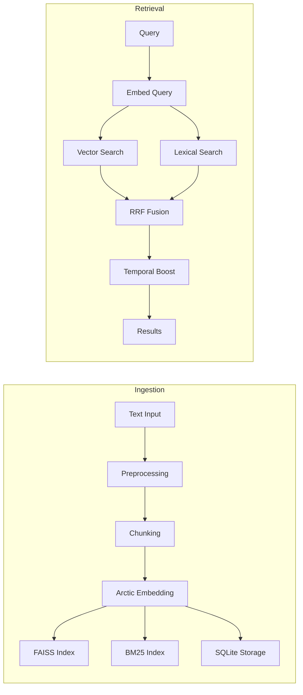

# Project Context: Artemis - Local AI Agent

> **Документ для ИИ-ассистентов:** Этот файл содержит полный контекст проекта для продолжения разработки.

---

## 🖥️ Hardware Constraints (CRITICAL)

| Компонент | Характеристики | Ограничения |
|-----------|---------------|-------------|
| **GPU** | NVIDIA GeForce GTX 1650 | 4 GB VRAM |
| **RAM** | System RAM | 16 GB |
| **CPU** | Intel Core i5-12450H | 8 cores / 12 threads |
| **OS** | Windows 11 Pro + WSL2 | Debian-based |

> [!CAUTION]
> **VRAM является критическим ограничением.** Все модели должны использовать квантизацию (Q4/Q8). Одновременно может работать только один GPU-процесс.

---

## 🛠️ Technology Stack

### Backend (WSL2/Debian)

| Компонент | Технология | Детали |
|-----------|-----------|--------|
| Framework | FastAPI | Python 3.11+ |
| LLM Engine | `llama-cpp-python` | CUDA support, 32 GPU layers |
| LLM Model | Phi-3-mini-4k-instruct | Q4 quantization, 3.8B params |
| ASR Engine | `faster-whisper` (small) | CPU-only (cuDNN limitation) |
| Embeddings | Snowflake Arctic | MRL-optimized, 256/768 dims |
| Agent | LangChain ReAct | DuckDuckGo + Playwright |
| Database | SQLite | sessions.db + memory_records |
| Vector Store | FAISS (HNSW) | IndexHNSWFlat |
| Lexical Index | BM25 | rank_bm25 library |
| Concurrency | AsyncIO | Global GPU Lock |

### Frontend (Vite + React)

| Компонент | Технология |
|-----------|-----------|
| Framework | React 18 + Vite |
| Styling | TailwindCSS |
| Audio | Web Audio API |
| State | React hooks (useState/useEffect) |

---

## 📁 Project Structure

```
Artemis/
├── backend/
│   └── app/
│       ├── main.py                 # FastAPI entry point
│       ├── core/
│       │   ├── config.py           # Settings (model paths, GPU layers)
│       │   ├── llm_engine.py       # Llama model singleton
│       │   ├── asr_engine.py       # Whisper model singleton (CPU)
│       │   └── global_lock.py      # Async GPU lock
│       ├── db/
│       │   ├── database.py         # SQLAlchemy setup
│       │   ├── models.py           # ChatSession, ChatMessage
│       │   └── memory_models.py    # MemoryRecordDB, ArchivedMemoryRecordDB
│       ├── routers/
│       │   ├── sessions.py         # Session CRUD
│       │   └── memory.py           # Memory API routes
│       ├── services/
│       │   ├── memory_service.py   # Memory integration wrapper
│       │   ├── archival_service.py # Background archival worker
│       │   └── summarization_worker.py  # Auto-summarization
│       └── agent/
│           ├── executor.py         # ReAct agent executor
│           └── tools.py            # Search & Browser tools
│
├── memory_module/                  # 📦 Standalone Memory Package
│   ├── __init__.py
│   ├── service.py                  # High-level MemoryService
│   ├── models.py                   # Pydantic models (MemoryRecord, etc.)
│   ├── interfaces.py               # Abstract interfaces (IVectorStore, etc.)
│   ├── config/
│   │   └── settings.py             # Memory-specific settings
│   ├── embeddings/
│   │   └── arctic_service.py       # Snowflake Arctic embeddings
│   ├── search/
│   │   ├── hybrid.py               # HybridSearchService (RRF fusion)
│   │   ├── vector_store.py         # FAISSVectorStore (HNSW)
│   │   └── lexical.py              # BM25LexicalIndex
│   ├── storage/
│   │   └── postgresql.py           # PostgreSQLMetadataStore
│   ├── workers/
│   │   └── cleanup.py              # Background cleanup worker
│   ├── api/
│   │   └── routes.py               # Memory module API routes
│   ├── alembic/                    # Database migrations
│   └── tests/                      # Unit & integration tests
│
├── frontend/
│   ├── src/
│   │   ├── App.jsx                 # Main app logic
│   │   ├── main.jsx                # Entry point
│   │   ├── index.css               # Global styles
│   │   └── components/
│   │       ├── Sidebar.jsx         # Session list
│   │       ├── ChatArea.jsx        # Message display
│   │       ├── InputBar.jsx        # Input + agent toggle
│   │       └── AudioRecorder.jsx   # Voice input
│   ├── index.html
│   ├── vite.config.js
│   └── package.json
│
├── models/                         # Model weights (gitignored)
│   └── Phi-3-mini-4k-instruct-q4.gguf
│
├── scripts/
│   ├── setup_env.sh                # Full environment setup
│   ├── cuda_setup.sh               # CUDA Toolkit 12.9 install
│   ├── fix_cuda_wsl.sh             # Fix CUDA conflicts
│   ├── download_model.py           # Download LLM weights
│   ├── download_embedding_model.py # Download Arctic model
│   ├── backup_memories.py          # Export memories to JSONL
│   └── restore_memories.py         # Import from backup
│
├── tests/
│   ├── test_setup.py
│   └── verify_persistence.py
│
├── sessions.db                     # SQLite: sessions & messages
└── PROJECT_CONTEXT.md              # 📄 This file
```

---

## ⭐ Key Features & Implementation

### 1. Memory Module (memory_module/)

**Цель:** Долгосрочная семантическая память с гибридным поиском.



**Компоненты:**

| Файл | Назначение |
|------|-----------|
| `service.py` | Оркестратор всех компонентов |
| `search/hybrid.py` | Гибридный поиск (Vector + BM25 + RRF) |
| `search/vector_store.py` | FAISS с IndexHNSWFlat |
| `search/lexical.py` | BM25 через rank_bm25 |
| `embeddings/arctic_service.py` | Snowflake Arctic embeddings |
| `storage/postgresql.py` | Метаданные в SQLite/PostgreSQL |

**Особенности Hybrid Search:**

```python
# Алгоритм слияния результатов (Linear Combination + MinMax Normalization)
final_score = (weight * normalized_semantic) + ((1 - weight) * normalized_lexical)
final_score *= temporal_boost  # Boost recent memories
```

- **hybrid_weight**: 0.0 = только лексический, 1.0 = только векторный
- **temporal_boost**: `1 / (1 + age_hours / half_life)`
- **Default half_life**: 168 часов (1 неделя)

---

### 2. Archival Service (backend/app/services/)

**Цель:** Автоматическая архивация старых записей для экономии ресурсов.

**Workflow:**
1. Background task проверяет лимиты каждые N минут
2. Старые записи (по created_at) сжимаются gzip
3. Перемещаются в `archived_memory_records`
4. Удаляются из активных индексов (FAISS, BM25)
5. Возможно восстановление через `/restore/{id}`

**Лимиты:**
- `MAX_ACTIVE_RECORDS`: 10,000
- `ARCHIVE_THRESHOLD_DAYS`: 30

---

### 3. Embedding Service (Arctic)

**Модель:** `Snowflake/snowflake-arctic-embed-m-v2.0`

**Особенности:**
- **MRL (Matryoshka Representation Learning)**: Поддержка размерностей 256/512/768
- **Truncated Embeddings**: Можно использовать первые N измерений
- **ONNX Runtime**: Локальный inference без API

**Конфигурация:**
```python
EMBEDDING_MODEL = "Snowflake/snowflake-arctic-embed-m-v2.0"
EMBEDDING_DIM = 768        # Full dimension
TRUNCATED_DIM = 256        # For initial filtering (MRL)
```

---

### 4. CUDA Configuration (WSL2)

> [!IMPORTANT]
> Используется CUDA Toolkit 12.9 напрямую от NVIDIA, НЕ Debian пакет.

**Environment (~/.bashrc):**
```bash
export PATH=/usr/local/cuda/bin:$PATH
export LD_LIBRARY_PATH=/usr/local/cuda/lib64:$LD_LIBRARY_PATH
```

**Build llama-cpp-python:**
```bash
CMAKE_ARGS="-DGGML_CUDA=on -DCMAKE_CUDA_ARCHITECTURES=75" pip install llama-cpp-python
```

> **75** = Turing architecture (GTX 1650)

---

### 5. Audio Transcription

**Проблема:** cuDNN недоступен в WSL для faster-whisper.

**Решение:**
- Whisper работает на **CPU** с `compute_type="int8"`
- Язык зафиксирован: `language="ru"`
- Frontend: Тишина 2 секунды → автоотправка

---

### 6. GPU Concurrency

```python
# backend/app/core/global_lock.py
gpu_lock = asyncio.Lock()

# Usage
async with gpu_lock:
    result = await llm.generate(...)
```

> [!WARNING]
> **Все GPU-операции** (LLM, Embeddings) должны использовать `gpu_lock`.

---

### 7. Agent Mode (LangChain ReAct)

**Инструменты:**

| Tool | Назначение |
|------|-----------|
| `search_web` | DuckDuckGo (5 результатов) |
| `browse_url` | Playwright headless browser |

**Безопасность:**
- File system access полностью заблокирован
- Agent не может писать файлы

**Endpoint:** `POST /v1/agent/run`

---

## 🔌 API Endpoints

### Chat & Sessions

| Method | Endpoint | Описание |
|--------|----------|----------|
| POST | `/v1/chat/completions` | Генерация ответа LLM |
| POST | `/v1/audio/transcriptions` | Whisper STT |
| POST | `/v1/sessions` | Создать сессию |
| GET | `/v1/sessions` | Список сессий |
| GET | `/v1/sessions/{id}/messages` | История сессии |
| DELETE | `/v1/sessions/{id}` | Удалить сессию |

### Agent

| Method | Endpoint | Описание |
|--------|----------|----------|
| POST | `/v1/agent/run` | Выполнить agent task |

### Memory

| Method | Endpoint | Описание |
|--------|----------|----------|
| POST | `/v1/memory/store` | Сохранить память |
| POST | `/v1/memory/query` | Поиск по памяти |
| GET | `/v1/memory/{id}` | Получить запись |
| DELETE | `/v1/memory/{id}` | Удалить запись |
| GET | `/v1/memory/stats` | Статистика |
| POST | `/v1/memory/archive/restore/{id}` | Восстановить из архива |

---

## 🚀 Setup Instructions

### First-Time Setup (WSL2)

```bash
# 1. Install CUDA Toolkit
./scripts/cuda_setup.sh

# 2. Setup Python environment
./scripts/setup_env.sh

# 3. Download models
source venv/bin/activate
python scripts/download_model.py           # LLM
python scripts/download_embedding_model.py # Arctic

# 4. Start backend
cd backend
uvicorn app.main:app --reload --host 0.0.0.0 --port 8000
```

### Frontend Setup (Windows Terminal)

```bash
cd frontend
npm install
npm run dev  # http://localhost:5173
```

---

## ⚠️ Known Issues & Fixes

| Проблема | Причина | Решение |
|----------|---------|---------|
| `ggml_cuda_init: failed` | Conflicting nvidia-cuda-toolkit | `./scripts/fix_cuda_wsl.sh` |
| Whisper crash | Missing cuDNN | Используется CPU mode |
| Audio not sent | Old implementation | Auto-send after transcription |
| Memory OOM | Too many records | Archival service limits |

---

## 📊 Performance Characteristics

| Метрика | Значение |
|---------|----------|
| LLM Inference | ~3-5 tokens/sec (GPU) |
| Audio Transcription | ~2-3x realtime (CPU) |
| Cold Start | ~5-10 sec |
| LLM VRAM | ~2.5 GB |
| Embeddings VRAM | ~0.5 GB |
| Total VRAM | ~3.0-3.5 GB / 4 GB |

---

## 🛡️ Security Considerations

- ✅ Local-only app (no authentication)
- ✅ Agent file access restricted
- ✅ SQLAlchemy ORM (SQL injection protection)
- ✅ Same-origin via Vite proxy
- ⚠️ No HTTPS (local network only)

---

## 📝 Development Guidelines

### Adding New Endpoint

1. Создать route в `backend/app/routers/` или `main.py`
2. Использовать `Depends(get_db)` для БД
3. GPU операции: `async with gpu_lock:`
4. Обновить frontend `App.jsx`

### Adding Memory Features

1. Модели: `memory_module/models.py`
2. Интерфейсы: `memory_module/interfaces.py`
3. Сервис: `memory_module/service.py`
4. Миграции: `alembic revision --autogenerate`

### Adding Agent Tools

1. Определить `@tool` в `backend/app/agent/tools.py`
2. Добавить в executor
3. **Проверить безопасность!**

---

## 🔮 Future Improvements

- [ ] Streaming responses (SSE)
- [ ] Multi-modal input (LLaVA)
- [ ] Auto-summarization for context window
- [ ] Export/import sessions
- [ ] Dark mode toggle
- [ ] Voice output (TTS)
- [ ] Redis caching for embeddings
- [ ] PostgreSQL for production
- [ ] Context injection from memory

---

## 📚 Related Documentation

| Документ | Описание |
|----------|----------|
| `memory_module/README.md` | Memory module architecture |
| `.env.example` | Environment variables |
| `alembic.ini` | Migration configuration |

---

> **Последнее обновление:** 2025-12-18